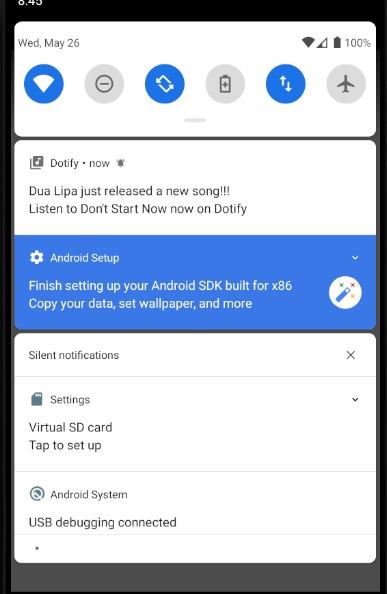

# Your App by Vanessa Sugiharto

This is an app for homework 5 that is a music player where you can turn on and off your notifications in the application itself. It will be when a song is chosen and is opened to the song detail, then the settings button is clicked, and then notification. Turning on the notification switch will give you notification about a new song released every 20 minutes, and clicking on that notification will direct you to a page of that song. Turning off the notification will stop doing this.

## Extra credit
1. Clicking the notification will launch PlayerActivity that passes in the data to the activity and show the song in the player.

## Screenshots

## Installation & Usage
Click on a song in the song list to pull up the mini player. Click the shuffle button on the mini player to shuffle the song list. Click the mini player to show that chosen song in more detail. Click the settings button in the song detail page will show 3 buttons where you can also navigate to those 4 different pages: profile, statistics, about and notification. Switching the notification switch on will give you updates every 20 minutes and clicking on it will direct you to that song's detail in PlayerActivity. Turning the notification switch off will disable it.